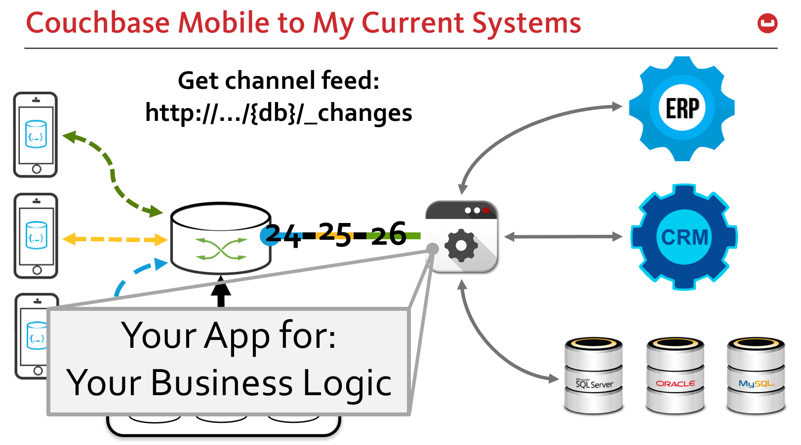

# sg-stream-demo

### Simple `_change`(event) feed listener for Sync Gateway / App Services

This script is a simple example of how to get a continuous data feed from Sync Gateway / App Services like IMAGE BELOW.

For a complete list of options to the _changes api go to: https://developer.couchbase.com/documentation/mobile/current/references/sync-gateway/rest-api/index.html#/database



## Setup Instructions

### 1. Download the Repository and Open Terminal

**Clone or download the repository:**
```bash
git clone https://github.com/Fujio-Turner/sg-stream-demo.git
cd sg-stream-demo
```

Or download the ZIP file from GitHub and extract it, then navigate to the extracted folder.

**Open Terminal:**
- **On Mac:** Open Terminal application (Applications > Utilities > Terminal) or press `Cmd + Space` and type "Terminal"
- **On Windows:** Open Command Prompt or PowerShell by pressing `Win + R`, typing `cmd` or `powershell`, and pressing Enter

**Navigate to the project directory:**
```bash
cd path/to/sg-stream-demo
```

### 2. Create a Virtual Environment

**On Mac/Linux:**
```bash
python3 -m venv venv
source venv/bin/activate
```

**On Windows:**
```bash
python -m venv venv
venv\Scripts\activate
```

### 3. Install Requirements

```bash
pip install -r requirements.txt
```

### 4. Configure Connection Parameters

#### For `sg_feed.py` (HTTP Changes Feed):

Open sg_feed.py and update the following parameters:

```python
secure = False            # Set to True for https (ALWAYS True for Couchbase Capella)
host = "localhost"        # Your Sync Gateway/App Services host
port = "4984"             # Your Sync Gateway/App Services port
sgDb = "db"               # Your database name
sgScope = "us"            # Your scope name
sgCollection = "prices"   # Your collection name
userName = "bob"          # Your username
password = "password"     # Your password
```

**Note:** When connecting to **Couchbase Capella**, you must set `secure = True` to use HTTPS.

**Optional:** Uncomment the channel filter section to filter by specific channels:
```python
channels = 'bob,water,cake'
url_param = url_param +'&filter=sync_gateway/bychannel&channels='+channels
```

#### For `sg_websocket_feed.py` (WebSocket Changes Feed):

Open sg_websocket_feed.py and update the following parameters:

```python
secure = False            # Set to True for wss (ALWAYS True for Couchbase Capella)
host = "localhost"        # Your Sync Gateway/App Services host
sgPort   = "4984"         # Your Sync Gateway/App Services port
sgDb = "db"               # Your database name
sgScope  = "us"           # Your scope name
sgCollection = "prices"   # Your collection name
username = "bob"          # Your username
password = "password"     # Your password
```

**Note:** When connecting to **Couchbase Capella**, you must set `secure = True` to use WSS (WebSocket Secure).

**Optional:** Uncomment the channel filter in the `on_open` function to filter by specific channels:
```python
channels = ["bob", "water", "cake"]
payload["filter"] = "sync_gateway/bychannel"
payload["channels"] = channels
```

### 5. Run the Scripts

#### Run HTTP Changes Feed:
```bash
python3 sg_feed.py
```

#### Run WebSocket Changes Feed:
```bash
python3 sg_websocket_feed.py
```

### 6. Testing

Make changes to your Sync Gateway database and watch the continuous feed display the changes in real-time.

Press `Ctrl+C` to stop the script.


## Important Note

**Unlike Couchbase Lite, which can open and sync multiple collections at once, these HTTP and WebSocket change feed methods require a separate connection for each collection you want to monitor.**