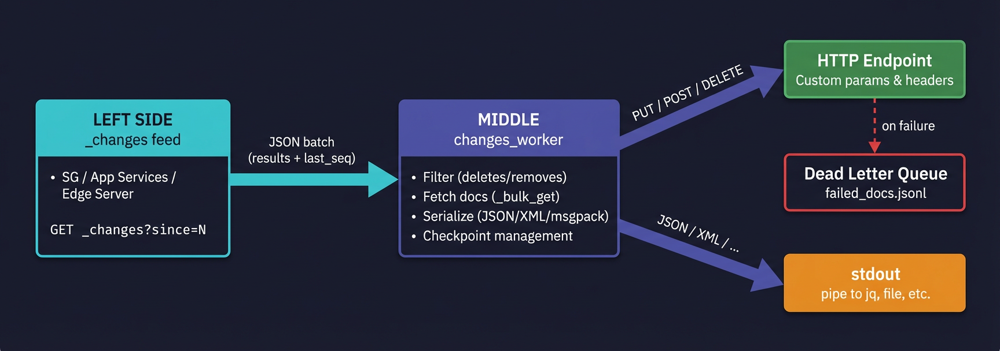
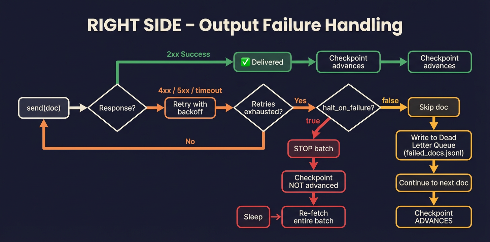
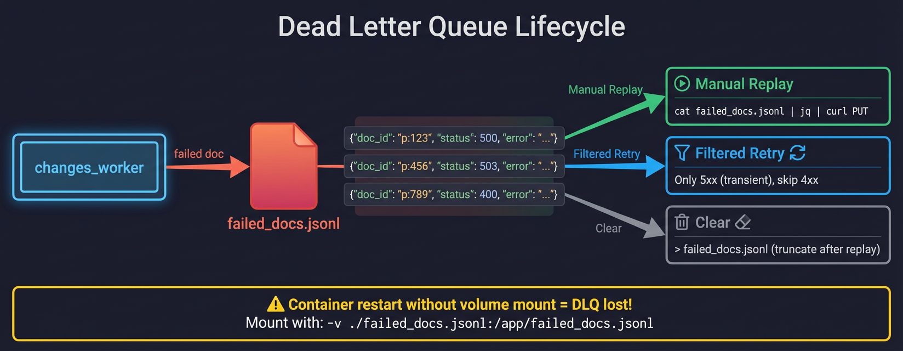

# Changes Worker – Design & Failure Modes

This document describes the internal architecture of the changes_worker, how data flows through the system, and what happens when things go wrong at every stage.

---

## Three-Stage Pipeline



| Stage | What it does |
|---|---|
| **LEFT** | Poll `_changes` on SG / App Services / Edge Server via longpoll (or continuous/SSE). Returns a batch of changes with `last_seq`. |
| **MIDDLE** | Filter (skip deletes/removes), optionally fetch full docs via `_bulk_get`, serialize to the output format, manage checkpoints. |
| **RIGHT** | Forward each doc to the output: `PUT/POST/DELETE` to an HTTP endpoint or write to stdout. Track success/failure per doc. |

---

## Sequential vs Parallel Processing


### Sequential (`sequential: true`)

```
change-1 → send → wait → change-2 → send → wait → change-3 → send → wait → checkpoint
```

- Documents are processed **one at a time, in feed order**.
- If a doc fails and `halt_on_failure=true`, processing stops immediately. The checkpoint has not advanced, so the entire batch retries on the next cycle.
- **Safest mode.** No race conditions. No duplicate deliveries. No reordering.
- **Trade-off:** Slow on large batches. A batch of 10,000 docs processes serially — if each PUT takes 50ms, that's ~8 minutes per batch.
- Supports `every_n_docs` sub-batch checkpointing (see below).

### Parallel (`sequential: false`, the default)

```
change-1 → send ─┐
change-2 → send ─┤ (up to max_concurrent tasks)
change-3 → send ─┤
...              ─┘→ await all → checkpoint
```

- Documents are processed **concurrently** using `asyncio.gather`, limited by `max_concurrent` (default 20).
- Much faster on large batches. Same 10,000 docs at 50ms each with `max_concurrent=20` → ~25 seconds.
- **Trade-offs:**
  - **Delivery order is not guaranteed.** Doc 500 may arrive at the endpoint before doc 1.
  - **Partial failure creates a race condition.** If 3 of 10 tasks fail but 7 succeed, the endpoint has already received 7 docs. With `halt_on_failure=true`, the checkpoint does NOT advance, so the next cycle re-fetches the same batch and those 7 docs get **re-delivered** (at-least-once semantics).
  - **Dead letter queue is more likely to be needed.** With `halt_on_failure=false`, failed docs go to the DLQ and the checkpoint advances — no re-delivery, but no retry either.
  - Does NOT support `every_n_docs` sub-batch checkpointing (checkpoint saves once after the full batch).

### Which should I use?

| Scenario | Recommendation |
|---|---|
| Data correctness is paramount, order matters | `sequential: true` |
| High throughput, endpoint is idempotent (PUT is safe to retry) | `sequential: false` |
| Large catch-up from `since=0` with 100K+ docs | `sequential: true` + `every_n_docs: 1000` + `throttle_feed: 10000` |
| Low-volume steady-state (< 100 changes per poll) | Either works, default parallel is fine |

---

## Checkpoint Strategy


The checkpoint records the highest sequence number that has been **fully processed and delivered**. It is stored on Sync Gateway as a `_local/` document (CBL-compatible format).

### Per-Batch Checkpointing (default)

```
poll → get 500 changes → process all 500 → save checkpoint(last_seq=500)
poll → get 50 changes  → process all 50  → save checkpoint(last_seq=550)
```

The checkpoint saves **once per batch, after every doc in the batch is processed.** This is the simplest and safest approach. If the worker crashes mid-batch, it restarts from the previous checkpoint and re-processes the batch.

**Problem:** A `since=0` catch-up returning 100,000 changes in one batch means one checkpoint save at the end. Crash at doc 50,000 = restart from zero.

**Solution:** Use `throttle_feed` to break large feeds into smaller batches at the API level:

```jsonc
"throttle_feed": 10000  // 100K docs → 10 batches of 10K, 10 checkpoint saves
```

### Sub-Batch Checkpointing (`every_n_docs`)

For even finer granularity within a batch, set `checkpoint.every_n_docs`:

```jsonc
"checkpoint": {
  "every_n_docs": 1000  // save checkpoint every 1000 docs within a batch
}
```

```
poll → get 5000 changes →
  process docs 1-1000    → save checkpoint(seq of doc 1000)
  process docs 1001-2000 → save checkpoint(seq of doc 2000)
  process docs 2001-3000 → save checkpoint(seq of doc 3000)
  ...
```

**Requires `sequential: true`.** Each change in the `_changes` feed has its own `seq` value. In sequential mode, we know that all docs up to the current one have been processed, so we can safely advance the checkpoint to that doc's `seq`. In parallel mode, docs are processed out of order, so we can't determine a safe checkpoint boundary mid-batch.

### Checkpoint Save Cost

Each checkpoint save is a `PUT` to `{keyspace}/_local/checkpoint-{uuid}` on Sync Gateway. This is a lightweight metadata write — not a full document mutation — so it's fast (typically < 5ms). Even with `every_n_docs: 100` on a 10K batch, that's 100 checkpoint saves × 5ms = 0.5 seconds of overhead.

**Do NOT set `every_n_docs: 1`.** That saves a checkpoint after every single doc, which adds unnecessary overhead and load on SG. Values of 100–1000 are practical.

---

## Failure Modes

### LEFT SIDE – _changes Feed Failures

| Failure | What happens | Recovery |
|---|---|---|
| **SG unreachable** (connection refused, DNS failure) | `RetryableHTTP` retries with exponential backoff (up to `retry.max_retries`). | If retries exhausted, logs error, sleeps `poll_interval_seconds`, then retries the entire poll on the next loop iteration. Checkpoint is NOT advanced. |
| **SG returns 5xx** (server error) | Same as above — retried with backoff. | Same recovery. |
| **SG returns 4xx** (auth failure, bad request) | **Non-retryable.** Logged as error. | **Worker stops the poll loop entirely** (breaks out of `while` loop). This usually means bad credentials or a deleted database — requires manual intervention. |
| **SG returns 3xx** (redirect) | **Non-retryable.** Logged as error. | Same as 4xx — worker stops. |
| **HTTP timeout** (`http_timeout_seconds` exceeded) | Treated as connection error — retried. | Increase `http_timeout_seconds` for large `since=0` catch-ups. |
| **Malformed JSON response** | `json.loads` raises, caught as generic exception. | Logged, retried on next loop iteration. |

**Key guarantee:** The checkpoint is NEVER advanced if the `_changes` poll fails. On restart, the worker picks up from the last saved `since` value.

### MIDDLE – Processing Failures

| Failure | What happens | Recovery |
|---|---|---|
| **`_bulk_get` fails** (when `include_docs=false`) | Retried by `RetryableHTTP`. | If retries exhausted, same as LEFT side — sleeps and retries. No docs are forwarded, checkpoint not advanced. |
| **Individual doc `GET` fails** (Edge Server, no `_bulk_get`) | Each doc fetch is retried independently. | Failed fetches result in the change being forwarded without the full doc body (uses the change metadata as-is). |
| **Serialization error** (e.g., doc can't be converted to XML) | `serialize_doc` raises `ValueError`. | Unhandled — crashes the worker. This is a bug in the data, not a transient failure. Fix the data or use a format that handles the doc structure. |
| **Checkpoint save fails** | Falls back to local `checkpoint.json` file. | On next startup, loads from the local file. Logged as warning. |

### RIGHT SIDE – Output Failures



This is where most operational failures occur. The behavior depends on `halt_on_failure` and whether a dead letter queue is configured.

#### With `halt_on_failure: true` (default — safest)

| Failure | What happens | Recovery |
|---|---|---|
| **5xx from endpoint** | `RetryableHTTP` retries with backoff (using `output.retry` config). If retries exhausted → raises `OutputEndpointDown`. | Worker stops processing the batch. Checkpoint is NOT advanced. Sleeps `poll_interval_seconds`, then re-fetches the same batch. The endpoint had time to recover. |
| **4xx from endpoint** | **Not retried** (client error = bad request, not transient). Raises `OutputEndpointDown`. | Same as 5xx — stops the batch, holds checkpoint. Fix the data or endpoint, then restart. |
| **3xx from endpoint** | **Not retried** (redirect = endpoint misconfigured). Raises `OutputEndpointDown`. | Same — holds checkpoint. Fix the URL. |
| **Connection refused / timeout** | Retried with backoff. If exhausted → `OutputEndpointDown`. | Same — holds checkpoint. |

**In parallel mode with partial failure:** If 7 of 10 tasks succeed before one raises `OutputEndpointDown`, those 7 docs were already delivered. The checkpoint does NOT advance, so the next cycle re-fetches all 10 and re-delivers the 7. **Your endpoint must be idempotent** (PUT is naturally idempotent; POST is not).

#### With `halt_on_failure: false` (+ dead letter queue)

| Failure | What happens | Recovery |
|---|---|---|
| **5xx / 4xx / 3xx / connection failure** | After retries exhausted, the doc is **skipped**. `send()` returns `{"ok": false, ...}` instead of raising. | The failed doc + error details are written to `failed_docs.jsonl`. The checkpoint advances past this doc. **The doc will NOT be retried automatically.** |

**Batch summary is always logged:**
```
INFO  BATCH SUMMARY: 7/10 succeeded, 3 failed (3 written to dead letter queue)
```

---

## Dead Letter Queue



### What it is

An append-only JSONL file where each line is a failed doc with full context:

```json
{
  "doc_id": "p:12345",
  "seq": "42",
  "method": "PUT",
  "status": 500,
  "error": "Internal Server Error",
  "time": 1768521600,
  "doc": {"_id": "p:12345", "price": 20.0, "_rev": "4-abc123"}
}
```

### When it's used

Only when **both** conditions are true:
1. `halt_on_failure: false` (worker skips failed docs instead of stopping)
2. `dead_letter_path` is set in config (e.g., `"dead_letter_path": "failed_docs.jsonl"`)

If `halt_on_failure: true`, the worker stops on failure and holds the checkpoint — no docs are lost, no DLQ needed.

### How to drain it

The dead letter queue is **not automatically drained.** It is a record of what failed so an operator or separate process can retry. Options:

1. **Manual replay:**
   ```bash
   # Read each failed doc and retry the PUT
   while IFS= read -r line; do
     doc_id=$(echo "$line" | jq -r '.doc_id')
     doc=$(echo "$line" | jq -c '.doc')
     curl -s -X PUT "http://my-endpoint/api/$doc_id" \
       -H 'Content-Type: application/json' \
       -d "$doc"
   done < failed_docs.jsonl
   ```

2. **Scripted retry with status filtering:**
   ```bash
   # Only retry 5xx failures (transient), skip 4xx (permanent)
   jq -c 'select(.status >= 500)' failed_docs.jsonl | while IFS= read -r line; do
     # ... retry logic
   done
   ```

3. **Clear after successful replay:**
   ```bash
   # Truncate after all entries have been replayed
   > failed_docs.jsonl
   ```

### Container restart behavior

The DLQ file is written to the container's filesystem by default. **If the container is brought down, the file is lost** unless:

- **Bind-mount the file** in `docker-compose.yml`:
  ```yaml
  volumes:
    - ./config.json:/app/config.json:ro
    - ./failed_docs.jsonl:/app/failed_docs.jsonl
  ```

- **Or use a named volume:**
  ```yaml
  volumes:
    - dlq-data:/app/data
  ```
  With `"dead_letter_path": "data/failed_docs.jsonl"` in config.

When the container restarts, the worker **appends** to the existing file — it does not overwrite or replay it. Old entries from previous runs remain in the file until manually drained.

### Monitoring

The `dead_letter_total` Prometheus metric tracks how many docs have been written to the DLQ since the worker started:

```promql
# Alert if any docs are landing in the dead letter queue
rate(changes_worker_dead_letter_total[5m]) > 0
```

---

## Putting It All Together – Recommended Configurations

### Maximum Safety (no data loss, strict order)

```jsonc
{
  "processing": {
    "sequential": true,
    "max_concurrent": 1
  },
  "checkpoint": {
    "every_n_docs": 1000
  },
  "output": {
    "halt_on_failure": true
    // no dead_letter_path needed — worker stops on failure
  }
}
```

- Sequential processing, one doc at a time, in order.
- Checkpoint every 1000 docs — crash loses at most 1000.
- Any output failure stops the worker and freezes the checkpoint.
- On restart, re-processes from last checkpoint. No data lost. No duplicates.
- **Slowest but safest.**

### Maximum Throughput (at-least-once, idempotent endpoint)

```jsonc
{
  "processing": {
    "sequential": false,
    "max_concurrent": 50
  },
  "checkpoint": {
    "every_n_docs": 0
  },
  "output": {
    "halt_on_failure": true
  }
}
```

- Parallel processing, up to 50 concurrent tasks.
- Checkpoint per-batch (default).
- Output failure stops the batch — the next cycle re-delivers any docs from the partial batch.
- **Requires an idempotent endpoint** (PUT is safe; POST may create duplicates).
- Use `throttle_feed` for large catch-ups to keep batch sizes manageable.

### Best Effort (skip failures, log everything)

```jsonc
{
  "processing": {
    "sequential": false,
    "max_concurrent": 20
  },
  "output": {
    "halt_on_failure": false,
    "dead_letter_path": "failed_docs.jsonl"
  }
}
```

- Parallel processing.
- Failed docs are logged to the dead letter queue and skipped.
- Checkpoint advances regardless — failed docs are NOT retried automatically.
- **Fastest, but data can be lost if the DLQ is not drained.**
- Best for non-critical pipelines where occasional data loss is acceptable (e.g., analytics, search indexing).

---

## Data Flow Diagram

```
                                    ┌─────────────────────────────────┐
                                    │         SUCCESS PATH            │
                                    │                                 │
  _changes ──► filter ──► fetch ──► send ──► 2xx ──► checkpoint ──►  │
    (LEFT)     (MIDDLE)   (MIDDLE)  (RIGHT)          (MIDDLE)    sleep│
                                    │                                 │
                                    ├─────────────────────────────────┤
                                    │     FAILURE + halt_on_failure    │
                                    │                                 │
                                    │  send ──► 4xx/5xx/timeout       │
                                    │    └──► retry (backoff)         │
                                    │         └──► exhausted          │
                                    │              └──► STOP batch    │
                                    │                   checkpoint    │
                                    │                   NOT advanced  │
                                    │                   sleep ──► retry│
                                    │                                 │
                                    ├─────────────────────────────────┤
                                    │    FAILURE + !halt_on_failure    │
                                    │                                 │
                                    │  send ──► 4xx/5xx/timeout       │
                                    │    └──► retry (backoff)         │
                                    │         └──► exhausted          │
                                    │              └──► DLQ write     │
                                    │                   skip doc      │
                                    │                   continue      │
                                    │                   checkpoint    │
                                    │                   ADVANCES      │
                                    └─────────────────────────────────┘
```
